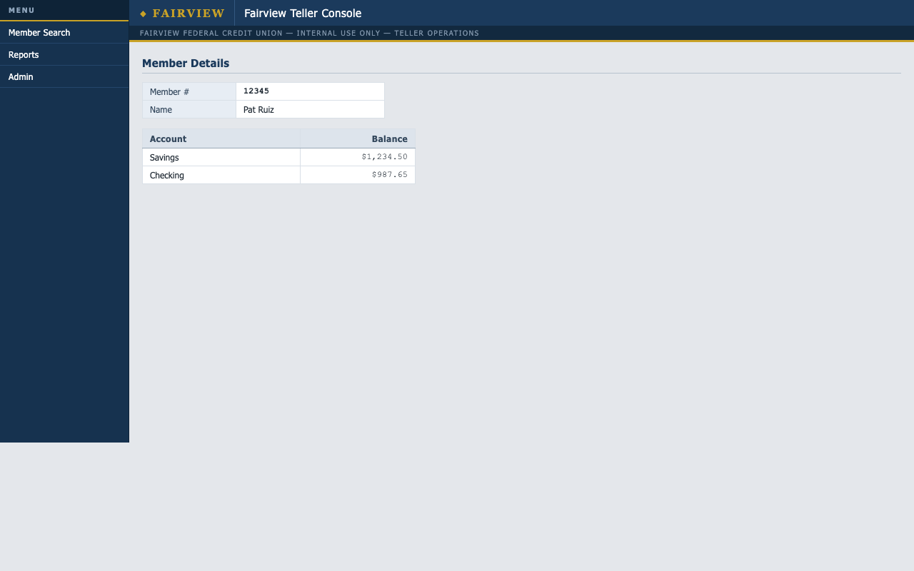

# agent-hands

Record-once / replay-many computer-use automation for legacy applications
that have no API. An LLM works out how to complete a task inside a real UI
**once** (discovery); the successful run is distilled into a typed, versioned
**capability artifact**; production invocations **replay** that artifact
deterministically — no model in the decision loop, proven by test.

```
      DISCOVERY (once, LLM)                      REPLAY (many, no LLM)
  goal + example params                      capability.json + params
        │                                          │
  observe → decide → act loop               requires → per step: pre → ladder
  (tool-forced, ref-grounded)               → act → post, recognizers polling
        │                                          │
  recorder distills & live-verifies         SUCCESS {typed outputs}
  every ladder rung, checkpoint,          | BUSINESS_OUTCOME {code, evidence}
  recognizer, and output anchor           | FAILURE {step, expected, observed}
        │                                 | PRECONDITION_FAILED | POLICY_VIOLATION
        ▼                                          ▲
  capability artifact  ────────────────────────────┘
  (typed params/outputs, closed outcome codes, locator ladders,
   recognizers with provenance, identity-bound checkpoint, risk labels)

  cross-cutting: policy (network-layer allowlist, risk-review gate)
                 trace (JSONL audit log, artifact hash, masked secrets)
                 escalation (pause → human on the SAME live session → resume)
```

Measured results: [evals/results.md](evals/results.md) — 10 injected runtime
states, each classified correctly; 10/10 replay stability; discovery cost
~3.5k tokens once vs **0 tokens** per replay. Evidence of real runs (including
the genuine LLM-driven discovery) is in [/evidence/](evidence/README.md).

## ⭐ The MERIDIAN CORE adaptation (the live build)

The core has been adapted to a hosted legacy credit-union console —
**MERIDIAN CORE** (`web-sample.interface-hiring.com`) — and wrapped so an agent
can drive it and a reviewer can watch it. Full write-up:
[docs/ADAPTATION.md](docs/ADAPTATION.md).

- **All 7 target functions live**: sign-on/session, member lookup (number +
  surname), account inquiry/balance, funds transfer (review → post),
  new-share origination, contact maintenance, and the supervisor-gated
  account hold — every artifact signed and live-verified, including the clean
  business outcomes (`MEMBER_NOT_FOUND`, `VALIDATION_REJECTED`,
  `SUPERVISOR_REQUIRED`) and a live escalation with TTL fail-safe.
- **Capability API** (`hands.api`, :8100) — invoke by name with typed args →
  a 5-way structured result + the contract hash; credentials from the
  environment, idempotency keys, currency input sanitizing.
- **Trust Dashboard** (`dashboard/`, :8200) — a plain-language, read-only view
  over the tamper-evident audit logs: per-run "No AI used ✓ · Approved by ✓ ·
  Recipe unchanged ✓ · Log tamper-evident ✓" chips, step-timing benchmarks,
  and evidence.
- **Chatbot console** (`chatbot/`, :8300) — plain English in, structured
  replay under the hood, live dashboard alongside.
- **Audit controls** — hash-chained traces (`verify_chain`), maker-checker
  four-eyes on risk sign-off, a per-run **Transfer Intent Gate** (human
  approves *this* member / from / to / amount before Post Transfer), and
  `hands explain <run_id>` — an examiner-grade audit receipt proving what
  ran, who approved the recipe and the run intent, and that no model was
  in the loop.




## Setup

Requires Python ≥ 3.12.

```bash
python3 -m venv .venv
.venv/bin/pip install -e ".[dev]"
.venv/bin/playwright install chromium
```

**Keys/config:** only discovery talks to a model. Put an API key for the
configured OpenAI-compatible endpoint in `.env` (never committed):

```
GROQ_API_KEY=gsk_...
```

Everything except `hands discover` runs **without any key or network** beyond
localhost — replay, the full test suite, and the eval runner are offline by
design.

## Demo path (60 seconds)

Terminal 1 — the target app (a deliberately legacy, no-API "credit union
back office" fixture):

```bash
.venv/bin/python -m fixture.app --port 8000
```

Terminal 2:

```bash
# 1. DISCOVERY: an LLM learns the flow and records a capability (needs .env key)
.venv/bin/hands discover capabilities/requests/lookup_member_balance.request.json

# 2. REVIEW: a human signs the risk labels (hash-bound; edits void it)
.venv/bin/hands review capabilities/generated/lookup_member_balance.json --operator you

# 3. REPLAY: deterministic, no LLM — with a member the model never saw
.venv/bin/hands replay capabilities/generated/lookup_member_balance.json --param member_id=67890
# → {"result": "success", "outputs": {"savings_balance": "52.00"}}

# 4. A missing member is an ANSWER, not a crash
.venv/bin/hands replay capabilities/generated/lookup_member_balance.json --param member_id=99999
# → {"result": "business_outcome", "code": "MEMBER_NOT_FOUND", ...}

# 5. Inject a session expiry — replay recovers by itself (watch with --headed)
curl -s -X POST -H "Content-Type: application/json" \
  -d '{"fault":"session_expired","enabled":true}' http://127.0.0.1:8000/__faults
.venv/bin/hands replay capabilities/lookup_member_balance.json --param member_id=12345 --headed

# 6. Human handoff: run attended, then open http://127.0.0.1:8321/ as the operator
.venv/bin/hands replay capabilities/lookup_member_balance.json --param member_id=12345 --attended

# 7. Transfer Intent Gate (per-run approval, not recipe review)
#    meridian_funds_transfer is ON by default — unattended replay fails closed.
#    Fairview has no transfer UI; --require-intent-approval opts any money-moving
#    artifact in. Approve/Deny at the console; then read the audit receipt.
.venv/bin/hands replay capabilities/generated/meridian_funds_transfer.json \
  --attended --intent-dual-control --invoker teller1 \
  --param operator_id=teller1 --param password="$HANDS_PARAM_PASSWORD" \
  --param member_number=100234 \
  --param from_share="Share Draft (Checking)" --param to_share=S0001-3 \
  --param amount=1
# → operator console: Approve transfer of $1 from Share Draft (Checking) → S0001-3 for member 100234?
.venv/bin/hands explain <run_id>
# → Transfer intent approved by 'supervisor1'; intent_hash=…; chain intact; model events=0
```

No key? Skip step 1 — `capabilities/` contains both a hand-written artifact
and the one a real discovery run produced (its transcript is in `/evidence/`).

## Verify the claims

```bash
.venv/bin/pytest                      # 117 tests: schema, ladder semantics, taxonomy,
                                      # escalation/handoff, intent gate, policy, hermetic zero-LLM proof
.venv/bin/python evals/run_evals.py   # regenerates evals/results.md
.venv/bin/ruff check . && .venv/bin/mypy
```

The zero-LLM claim is not a convention: `tests/test_zero_llm.py` replays in a
fresh subprocess with all key-shaped env vars stripped and non-loopback
network blocked at the socket level, and asserts success.

## What's here

| path | what |
|---|---|
| `src/hands/artifact.py` | the capability schema + load-time integrity validators (the contract) |
| `src/hands/replay.py` | deterministic replay engine: budgets, recognizers, recovery, escalation |
| `src/hands/surface.py` | perceive/act seam over Playwright: context paths, locator ladder, allowlist |
| `src/hands/planner.py` · `recorder.py` · `discover.py` | LLM discovery loop and live-verified distillation |
| `src/hands/escalation.py` | control-token state machine + operator console |
| `fixture/` | the target app: table-soup markup, no test IDs, injectable runtime faults |
| `capabilities/` | artifacts + discovery requests |
| `evidence/` · `evals/` | run records and measured results |
| `docs/DESIGN.md` | the full design, including decisions considered and rejected |

## Honest limitations

- **One surface implemented** (web/Playwright). The artifact schema is
  surface-neutral (context paths, geometric relations, no CSS except a flagged
  last-resort rung) and the seam is `WebSurface`; a desktop surface is a
  mapping exercise, not a rewrite — but it is design, not code. See REPORT §4.
- **Multi-tenant reuse is designed, not built** (overlays, variants, drift
  telemetry aggregation). What exists: per-step rung-hit telemetry, the
  fragility flag, and a drift eval showing a renamed label fails loudly.
- **Discovery redaction is containment, not magic.** Sensitive *parameters*
  never enter prompts (symbolic placeholders) and password fields are masked
  in observations — but page-native PII on a real system would reach the
  model during discovery. The architecture confines that exposure to the
  once-per-capability discovery event; replay sends nothing to any model.
- **The operator console is deliberately minimal** — the control-transfer
  model (token, capture, resume scan) is the real work; the console is a skin
  over it.
- The fixture is self-authored; a public-site portability leg was cut
  (REPORT §7).
