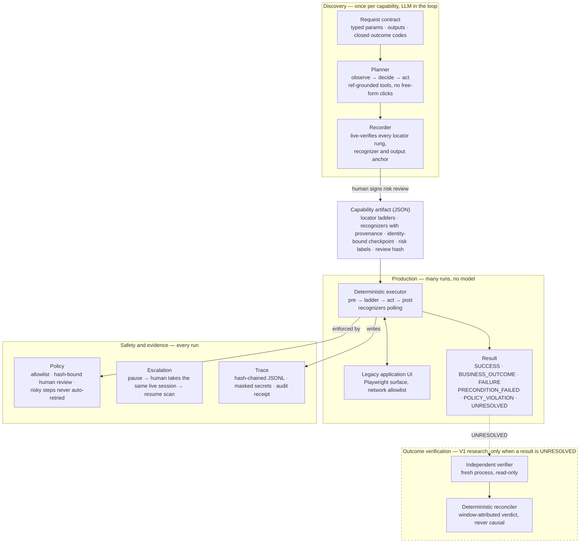
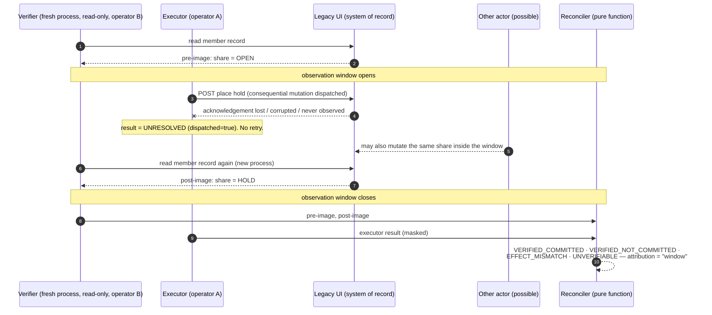
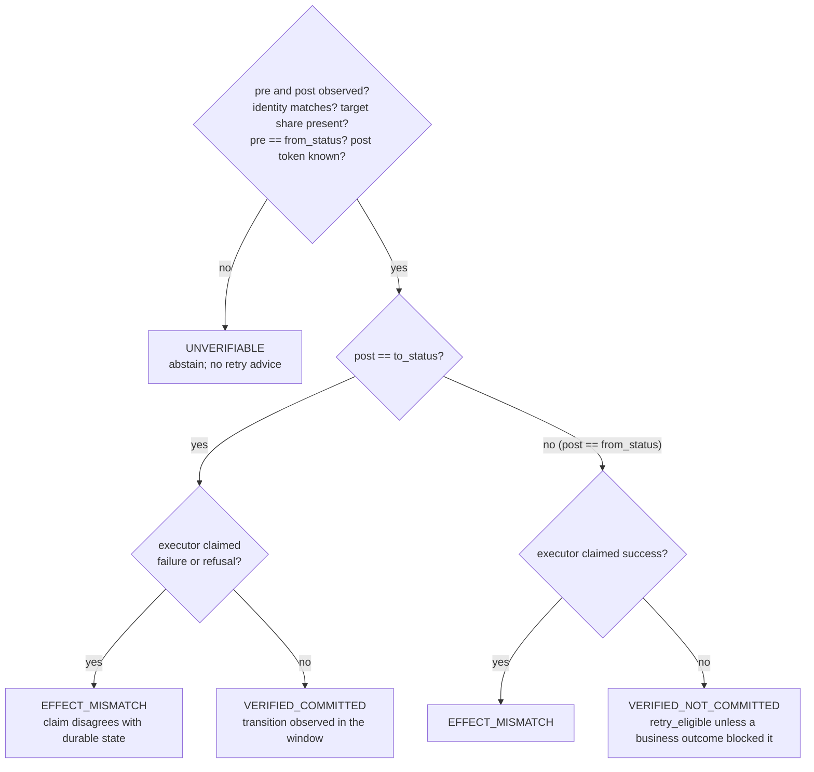
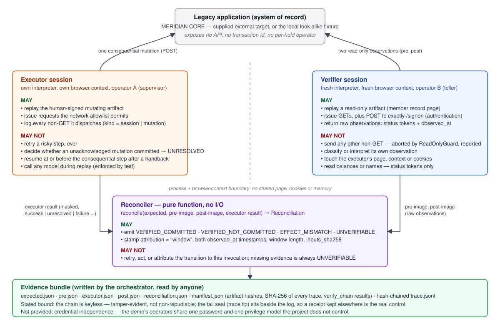
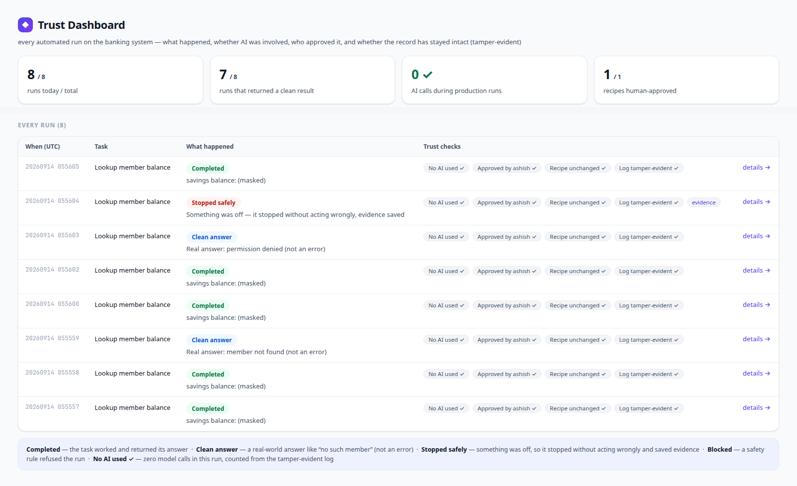
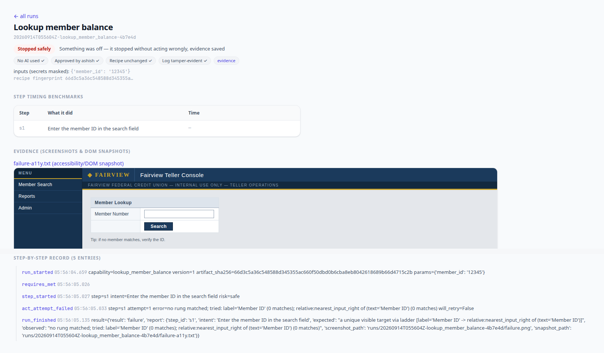
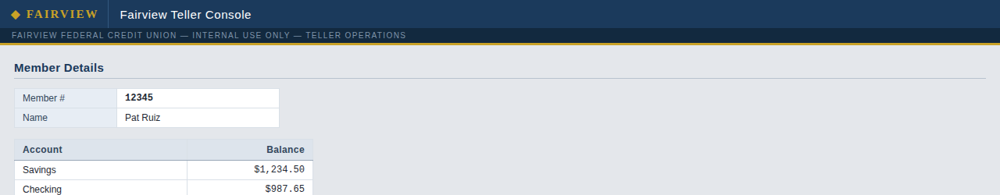

# Agent Hands

**Agent Hands is computer-use infrastructure for legacy financial software:
AI discovers workflows, compiles them into typed capabilities, and production
executes those capabilities deterministically with explicit safety, evidence,
and failure semantics.**

[](https://github.com/Ashishkosana/agent-hands/actions/workflows/ci.yml)
[](LICENSE)


A model is in the loop exactly once, at discovery time. Every production run
replays a reviewed, hash-bound capability artifact with no model call — a
property the test suite proves in a sealed subprocess rather than asserts by
convention. When a consequential action's outcome cannot be observed, the
engine says so (`UNRESOLVED`) instead of retrying or guessing, and a separate
read-only verifier settles what the durable state did.



## Why this exists

Core banking, lending and back-office systems in credit unions and banks are
often decades old, expose no API, and are operated through table-soup web
consoles or terminal emulators. Automating them today means either brittle
scripts pinned to CSS paths, or an LLM agent driving the UI live — which is
non-deterministic, expensive per run, and unacceptable for actions that move
money.

Three properties make this hard at the same time:

- **Determinism.** A production run must do the same thing every time and must
  be auditable afterwards. A model in the decision loop breaks both.
- **Ambiguity is the enemy, not errors.** "Member not found" is an answer. A
  locator that matches two elements is not a near miss; it is the moment the
  system must stop. Wrong-but-confident is the worst outcome.
- **Consequential actions can end in uncertainty.** A transfer or hold may
  have been committed even though the acknowledgement never arrived. Retrying
  can duplicate it; assuming failure can lose it. The honest result is "I do
  not know", followed by an independent way to find out.

Agent Hands is the infrastructure for that: discovery once, typed artifact,
deterministic replay, explicit failure semantics, and evidence for every run.

## Project status

Research prototype, tagged
[`v0.2.0-verifier`](https://github.com/Ashishkosana/agent-hands/releases/tag/v0.2.0-verifier).
Not for use against production banking systems. The table is the honest line
between built, demonstrated, and designed.

| component | scope | state |
|---|---|---|
| Discovery: planner, live-verifying recorder, contract-first requests | Fairview fixture (local); MERIDIAN CORE (one capability discovered end to end) | **Built**, real LLM transcripts committed |
| Capability artifact schema with load-time integrity validators | all | **Built**, tested |
| Deterministic replay: locator ladder, recognizers, two-level timeouts, recovery, no-double-fire | web surface (Playwright) | **Built**, tested, fixture eval matrix |
| Six-way result contract incl. `UNRESOLVED` for consequential steps | all | **Built**, tested |
| Policy: network allowlist, hash-bound human risk review, risky steps never auto-retried | all | **Built**, tested |
| Human escalation: control token, operator console, live-session handoff, resume scan, TTL fail-safe | fixture (evidence committed); MERIDIAN (exercised, not committed as traces) | **Built**, tested |
| Hash-chained traces, `verify_chain`, `hands explain` audit receipt | all | **Built**, tested; bounds stated below |
| Maker-checker (four-eyes) on risk sign-off | all | **Built**, tested; not demonstrated on the committed `meridian_*` artifacts (no recorded maker) |
| Capability API, trust dashboard, chatbot console | MERIDIAN CORE, Fairview | **Built** (demo surfaces) |
| Seven MERIDIAN capabilities: sign-on, lookup by number/surname, inquiry, transfer, new share, contact update, account hold | MERIDIAN CORE (supplied external target) | **Built and signed**; exercised live during development; live traces not committed except for V1 (below) |
| V1 outcome verification: read-only verifier, pure reconciler, chaos seam, twin evaluation | `meridian_place_hold` + `meridian_member_record`, local look-alike fixture + 3 live runs | **Built**, independently reviewed; twin artifacts pending human risk review |
| Desktop surface (UIA/AX), multi-tenant overlays, drift telemetry aggregation | — | **Designed, not built** |
| Causal attribution of an observed transition to a specific invocation | — | **Not built** (research problem, see roadmap) |

## Architecture

Two paths meet at one artifact, and one seam separates everything
browser-specific from everything else.

- **Discovery path** (`planner.py`, `recorder.py`, `discover.py`). An LLM
  works through the task in a real UI using tool calls that can only point at
  observed elements by reference — it cannot free-form a click or a selector.
  The recorder distills the run as it happens: each candidate locator rung,
  recognizer and output anchor is round-tripped through the same resolution
  engine replay will use, against the live page, before it is written down.
  One extra run per declared outcome code produces a live-verified recognizer
  for it.
- **The capability artifact** (`artifact.py`). Typed parameters and outputs,
  a closed set of outcome codes, per-step locator ladders (role → label →
  text → geometric relation → flagged CSS last resort), recognizers with
  provenance (`discovered` / `authored`, `verified_by_eval`), an
  identity-bound checkpoint that proves the right record was reached, risk
  labels per step, and a review hash that any edit invalidates.
- **Replay path** (`replay.py`, `conditions.py`, `values.py`). For each step:
  preconditions → ladder resolution (0 matches → next rung, >1 → refuse) →
  fingerprint-verified action → postcondition, with recognizers polled
  throughout. Every extracted value is parse-verified against the recorded
  expectation. No model, no coordinates, no `sleep` as synchronization.
- **The surface seam** (`surface.py`). Perceive and act over Playwright:
  context paths, locator ladder, network allowlist, and a context-wide log of
  every non-GET request the page dispatches, classified as `session`
  (authentication) or `mutation`.
- **Cross-cutting**: policy and risk review, the escalation state machine
  (`escalation.py`), hash-chained tracing (`trace.py`), and the outcome
  verification components described below.

The full design, including the alternatives considered and rejected, is in
[`docs/DESIGN.md`](docs/DESIGN.md). Three mechanisms are examined
code-line by code-line in
[`docs/ARCHITECTURE_DEEPDIVE.md`](docs/ARCHITECTURE_DEEPDIVE.md).

## Reliability and safety

**Result contract.** Every run ends in exactly one of six results, and a
caller can enumerate every code it may receive:

| result | meaning |
|---|---|
| `SUCCESS` | checkpoint confirmed the right record; typed outputs extracted and parse-verified |
| `BUSINESS_OUTCOME` | a recognized, declared answer such as `MEMBER_NOT_FOUND`, `VALIDATION_REJECTED`, `SUPERVISOR_REQUIRED`, with the matched region text as evidence |
| `FAILURE` | expected state not reached; the report names the step, what was expected, what was observed, and the rungs tried; screenshot and accessibility snapshot saved |
| `PRECONDITION_FAILED` | a declared `requires` was not met before acting |
| `POLICY_VIOLATION` | an unsigned risky replay, or traffic outside the allowlist |
| `UNRESOLVED` | a consequential mutation was observed leaving the browser and the run then failed to observe its outcome; nothing is retried |

**Never guess.** Ambiguity at any rung, any dropdown option, or any value
parse is a hard stop, never a heuristic. Uniqueness is not correctness, so
every resolved element is fingerprint-verified and every value is checked
against the recorded expectation.

**Risky steps are never auto-retried** and never replayed unattended without
a human-signed, hash-bound risk review. The reviewer's identity is bound into
the hash; where a maker identity was recorded at discovery, the maker may not
approve their own risky steps.

**Escalation keeps one driver on the session.** An unrecognized blocking
state raises an intervention with the step, the reason, masked parameters and
the recent trace. A human takes over the *same* live browser session through
an engine-owned control token; on handback the engine resume-scans forward
rather than blindly retrying. An unanswered intervention fails safe at its
TTL. Handback may never resume at or before a consequential step that already
dispatched.

**Evidence, with its bounds stated.** Every run writes an append-only,
hash-chained JSONL trace with secrets masked; `verify_chain` detects any
edit, removal or reordering of a record, and `hands explain <run_id>` rebuilds
the run into an audit receipt. The chain is keyless: it is tamper-evident, not
non-repudiable, and truncating the tail is undetectable without an external
anchor. Those are the documented production next steps, not hidden gaps.

**Zero model calls in production is tested, not asserted.**
`tests/test_zero_llm.py` replays in a fresh subprocess with every key-shaped
environment variable stripped and non-loopback sockets blocked at the socket
layer, and asserts success.

## Measured results

All numbers below are scoped to what produced them. None are production-scale
banking validation.

### Runtime-state classification — local Fairview fixture

From [`evals/results.md`](evals/results.md), generated by
`evals/run_evals.py` against the fixture's fault switches; every row is also
enforced as a test assertion.

| scenario | expected | actual | latency |
|---|---|---|---|
| happy path / fresh parameters | success | success | 0.8–1.4 s |
| member not found · server-side validation · permission denied | business outcome | business outcome (correct code) | 0.8–1.1 s |
| session expired · maintenance interstitial | success (recovered) | success (recovered) | 1.4 s |
| transient slow load (5 s) | success | success | 5.7 s |
| application error (HTTP 500) | failure | failure | 10.8 s |
| UI drift (renamed label) | failure, listing every rung tried | failure | 0.5 s |

10 of 10 scenarios classified correctly; 5 of 5 recognizers exercised.
Replay stability: 10 of 10 runs, mean 0.85 s, max 1.13 s. Discovery vs
replay for this capability: 3 model calls and 3,462 tokens once (the happy
run; the outcome-code run brings the total to roughly 7k), versus 0 calls and
0 tokens per replay.

### V1 outcome verification — reviewed checkpoint `v0.2.0-verifier`

From [`evals/twin_results.md`](evals/twin_results.md), generated by
`evals/run_twin_evals.py`. Local and live numbers are separate and must not
be added.

| measure | local look-alike fixture (`fixture/meridian.py`, ground truth from `/__state`) |
|---|---|
| verified runs across 9 fault scenarios + refusal | **92 / 92** classified as expected, on both the verdict and the executor's result kind |
| false `VERIFIED_COMMITTED` (verdict committed, truth not) | **0** observed |
| false `VERIFIED_NOT_COMMITTED` (verdict not committed, truth committed) | **0** observed |
| deliberately unavailable verifier (scenario D) | **10 / 10** abstained with `UNVERIFIABLE` |
| spurious `UNVERIFIABLE` elsewhere | **0** of 80 judged runs |
| pre-image already `HOLD` | 2 / 2 refused before anything was posted |

Live MERIDIAN CORE: one run each of lost-ack-committed, lost-ack-not-committed
and false-success, all classified as expected. Three runs on a shared demo
with no ground-truth endpoint; "truth" there is what the independent
verifier read, and the verdict is window attribution only.

Test suite at the checkpoint: **159 / 159** passing, `ruff` clean, strict
`mypy` clean. The count is not repeated elsewhere in this README so it does
not go stale; CI is the source of truth.

## Ambiguous outcomes (V1)

The buildathon-era engine could report five results. It could not say the
honest thing about a consequential action whose acknowledgement never
arrived. V1 adds the sixth result and an independent way to settle it.

**The rule.**

```
consequential mutation observed leaving the browser
  + any later failure to observe the outcome
  = UNRESOLVED   (never FAILURE, never SUCCESS, never a retry)
```

Sign-on POSTs are authentication, not mutation, so bad credentials remain a
plain `FAILURE`; a definite server refusal after dispatch
(`TRANSACTION_REJECTED`) remains a `BUSINESS_OUTCOME`.



**What a verdict means — and does not.** Every `Reconciliation` carries
`attribution = "window"` together with both observation timestamps and the
window length. `VERIFIED_COMMITTED` means *the target was observed to move
`OPEN → HOLD` between the two reads*. It does **not** establish that this
invocation caused the move: another actor can mutate the same share inside
the window, and MERIDIAN's UI exposes no transaction id, correlation token or
per-hold operator that would tell the two apart. Evaluation scenario H
(`THIRD_PARTY_MUTATION`) constructs exactly that case and the verdict is,
correctly, `VERIFIED_COMMITTED` — correct about the window and silent about
the cause.



| verdict | asserts | does not assert | what happens next |
|---|---|---|---|
| `VERIFIED_COMMITTED` | target reached the expected post-state inside the window | that this invocation caused it | done; no retry |
| `VERIFIED_NOT_COMMITTED` | target stayed in the pre-state inside the window | that an effect is not still in flight beyond the window | `retry_eligible` is advice only; nothing in the repository acts on it |
| `EFFECT_MISMATCH` | the executor's claim disagrees with the durable state | which side is at fault | escalate; evidence bundle has both |
| `UNVERIFIABLE` | evidence is insufficient | anything about the effect | escalate; never converted into success |

Trust boundaries between the components:



**What V1 does not claim.** Exactly-once execution. Causal attribution.
Duplicate prevention on a live system. Race-free or persistent idempotency at
the API (the in-memory key check is documented as a known gap). Novelty —
[`docs/PRIOR_ART.md`](docs/PRIOR_ART.md) lists the established work this
builds on and states the narrow part that appears less well covered. Credential
independence — the demo's operators share one password and privilege model.
The twin artifacts (`meridian_place_hold`, `meridian_member_record`) are
currently **pending human risk review** (`reviewed_by: null`); the live
runner refuses until a human signs them.

Design as built, deviations and backlog:
[`docs/VERIFIER_TWINS.md`](docs/VERIFIER_TWINS.md).

## Demo

The five-minute path runs entirely offline against the Fairview Teller
Console, a deliberately legacy fixture authored in this repository
(table-soup markup, no test IDs, a navigation iframe, six injectable faults).

Terminal 1:

```bash
.venv/bin/python -m fixture.app --port 8000
```

Terminal 2:

```bash
A=capabilities/lookup_member_balance.json      # authored artifact: 3 outcome codes, 5 recognizers

# Deterministic replay, no model, with a member the artifact never saw
.venv/bin/hands replay $A --param member_id=67890
# → {"result": "success", "outputs": {"savings_balance": "52.00"}}

# A missing member is an answer, not a crash
.venv/bin/hands replay $A --param member_id=99999
# → {"result": "business_outcome", "code": "MEMBER_NOT_FOUND", ...}

# Inject a session expiry: the recognizer fires, replay recovers, the run succeeds
curl -s -X POST -H "Content-Type: application/json" \
  -d '{"fault":"session_expired","enabled":true}' http://127.0.0.1:8000/__faults
.venv/bin/hands replay $A --param member_id=12345 --headed

# Rename a label: the recipe stops loudly and lists every rung it tried
curl -s -X POST -H "Content-Type: application/json" \
  -d '{"fault":"renamed_label","enabled":true}' http://127.0.0.1:8000/__faults
.venv/bin/hands replay $A --param member_id=12345
# → {"result": "failure", "report": {"step_id": "s1", "observed": "no rung matched; tried: ..."}}

# Human handoff: run attended, then open http://127.0.0.1:8321/ as the operator
.venv/bin/hands replay $A --param member_id=12345 --attended

# Rebuild any run into an audit receipt
.venv/bin/hands explain <run_id>
```

Two artifacts exist for this capability on purpose.
`capabilities/generated/lookup_member_balance.json` is the one a real
LLM-driven discovery run produced (its transcript is in `evidence/`); it
knows one outcome code. `capabilities/lookup_member_balance.json` is the
authored artifact with the additional recognizers the fault demos exercise.
To run discovery yourself: `hands discover
capabilities/requests/lookup_member_balance.request.json` with a key
configured as described under *Running locally*.

The dashboard and API can be pointed at either target:

```bash
HANDS_APP=fairview-teller .venv/bin/python -m dashboard.app --port 8200
```

<p align="center">
  
  <br><sub><b>Built by this project.</b> The trust dashboard (cropped) after eight replays against the <b>local Fairview fixture</b>: success, business outcomes, two recovered faults, and one stopped-safely UI-drift run. Chips are computed from the hash-chained trace. The amber "four-eyes not verifiable" chip is honest: this artifact has no recorded maker.</sub>
</p>

<p align="center">
  
  <br><sub><b>Built by this project.</b> Evidence page (cropped) for the UI-drift run: the fixture renamed "Member ID" to "Member Number"; the recipe stopped before acting, saved the failure screenshot and accessibility snapshot, and the step record lists every rung tried.</sub>
</p>

<p align="center">
  
  <br><sub><b>Local fixture, authored in this repository.</b> The Fairview Teller Console is not a real system; it exists to have a legacy-shaped target with injectable faults that runs offline.</sub>
</p>

**Against the supplied target.** MERIDIAN CORE
(`web-sample.interface-hiring.com`) is a hosted demo of a legacy credit-union
console supplied by a third party as the target for this work. It was not
built here and is not in this repository; it is shared with other users and
its data drifts. The seven `meridian_*` capabilities, the API, chatbot and
dashboard wrappers, and the local look-alike fixture used for chaos evaluation
are this project's. Running them is documented in
[`docs/ADAPTATION.md`](docs/ADAPTATION.md).

## Evidence

Curated run records are committed under `evidence/`; transient output goes to
the gitignored `runs/`. Each directory is indexed in
[`evidence/README.md`](evidence/README.md).

| location | what it proves |
|---|---|
| `evidence/discovery-run/`, `evidence/discovery-run-outcome/` | the genuine LLM-driven discovery: full model transcripts, per-call token usage, the two legs that produced the artifact |
| `evidence/artifact.json` | the exact signed artifact those discovery runs produced and the replays below executed |
| `evidence/replay-run*/` | deterministic replays: fresh parameter → `SUCCESS`; missing member → `BUSINESS_OUTCOME`; injected expiry → recovered; rejected input → `VALIDATION_REJECTED`. No `llm_call` event appears in any of them |
| `evidence/escalation-run/` | a live human handoff on the fixture: intervention record, failure screenshot, operator handback, resume scan, `SUCCESS` |
| `evidence/twin/local/<scenario>/` | one representative V1 bundle per chaos scenario: `expected/pre/executor/post/reconciliation/manifest.json` plus hash-chained traces |
| `evidence/twin/live/` | the three live MERIDIAN CORE twin runs |

An audit receipt, as `hands explain` prints it for the recovered run shown in
the dashboard above:

```
==============================================================
 AUDIT RECEIPT  ·  20260914T055600Z-lookup_member_balance-bad76e
==============================================================
 Capability:      lookup_member_balance  v1
 Contract hash:   66d3c5a36c548588d345355ac660f50dbd0b6cba8eb8042618689b66d4715c2b
 Contract status: VERIFIED — byte-identical to the artifact on disk
 Risk sign-off:   signed by 'ashish' (valid)
 Maker / Checker: recorded by '(not recorded)' / approved by 'ashish' (maker unknown -- four-eyes not bindable)
 Audit log:       TAMPER-EVIDENT: intact (hash chain verifies)
 Inputs (masked): {'member_id': '12345'}

 -- Decision trace --
  05:56:00.760  STEP s1  Enter the member ID in the search field  (safe)
  05:56:00.763  [!] recognized None -- Session Expired
  05:56:01.082  STEP s1  Enter the member ID in the search field  (safe)
  05:56:01.138       -> acted (type) via relative:nearest_input_right of (text='Member ID')
  05:56:01.140       ok verified
  05:56:01.140  STEP s2  Submit the member search  (safe)
  05:56:01.192       -> acted (click) via role=button name='Search'
  05:56:01.721       ok verified
  05:56:01.730  CHECKPOINT ok -- confirmed the right record
  05:56:01.773  OUTPUT savings_balance = «masked»

 -- Determinism --
 Model/LLM events in this run: 0  ->  NO model in the decision loop

 -- Result --
 {"result": "success", "outputs": {"savings_balance": "«masked»"}}
==============================================================
```

## Repository map

| path | what |
|---|---|
| `src/hands/artifact.py` | the capability schema and load-time integrity validators — the contract; start here |
| `src/hands/replay.py` | deterministic replay engine: budgets, recognizers, recovery, escalation glue, the consequential-action hazard that yields `UNRESOLVED` |
| `src/hands/surface.py` | perceive/act seam over Playwright: context paths, locator ladder, allowlist, dispatched-request log |
| `src/hands/conditions.py` · `values.py` · `results.py` | sensors, strict value parsing, the six-way result union |
| `src/hands/planner.py` · `recorder.py` · `discover.py` | the LLM discovery loop and live-verified distillation (the only modules that import a model client) |
| `src/hands/escalation.py` | control-token state machine and minimal operator console |
| `src/hands/trace.py` | hash-chained JSONL tracing and `verify_chain` |
| `src/hands/verifier.py` · `reconcile.py` · `twin.py` · `chaos.py` | V1: read-only observer, pure reconciler, twin orchestrator, fault injection |
| `src/hands/api.py` · `cli.py` | capability API (`/capabilities/<name>/invoke`) and the `hands` CLI (`replay`, `review`, `discover`, `explain`) |
| `dashboard/` · `chatbot/` | read-only trust dashboard; plain-English front door that routes to the API (never to replay) |
| `fixture/app.py` · `fixture/meridian.py` | the Fairview fixture; the MERIDIAN look-alike with a ground-truth endpoint for chaos evals |
| `capabilities/` | signed artifacts (`generated/`), the authored demo artifact, discovery requests |
| `scripts/build_capabilities.py` | authors the seven MERIDIAN artifacts through the schema from recorded prefix steps |
| `evals/` | `run_evals.py` → `results.md`; `run_twin_evals.py` → `twin_results.md` / `.json` |
| `evidence/` | committed run records (see above) |
| `tests/` | schema, ladder semantics, taxonomy, escalation, policy, API boundary, audit controls, reconciler, verifier twin, hermetic zero-LLM proof |
| `docs/` | [index](docs/README.md): design, adaptation write-up, V1 as built, prior art, deep-dive, hard questions, archived history |
| `CLAUDE.md` | the map an AI coding assistant reads before touching the code |

## Running locally

Python 3.12 or newer.

```bash
python3 -m venv .venv
.venv/bin/pip install -e ".[dev]"
.venv/bin/playwright install chromium
```

```bash
.venv/bin/pytest                          # full suite, offline
.venv/bin/ruff check . && .venv/bin/mypy  # lint and strict types
.venv/bin/python evals/run_evals.py                  # regenerates evals/results.md (starts the fixture itself)
.venv/bin/python evals/run_twin_evals.py --runs 10   # local twin matrix (starts fixture/meridian.py itself)
```

Only `hands discover` talks to a model. Put a key for an OpenAI-compatible
endpoint in `.env` (never committed) as `HANDS_API_KEY` (or `GROQ_API_KEY`),
with `HANDS_BASE_URL` and `HANDS_MODEL` to change provider. Everything else —
replay, the test suite, both eval runners against the local fixtures — needs
no key and no network beyond localhost. Replaying the `meridian_*`
capabilities needs network access to the hosted demo and its demo
credentials via `HANDS_PARAM_PASSWORD`; see `docs/ADAPTATION.md`.

CI runs lint, strict typing and the full suite on Python 3.12 and 3.13.

## Design decisions and prior art

- **Why an artifact, not a transcript.** A transcript is not typed, not
  reviewable, and not parameterizable. The artifact is JSON so that a human
  can diff it and sign it.
- **Why a locator ladder with a flagged CSS last rung.** Semantic and
  geometric locators survive re-skins; CSS paths do not. The ladder records
  which rung fired, so drift shows up as telemetry before it shows up as
  failure.
- **Why recognizers carry provenance.** An `authored` recognizer that no eval
  has exercised is a hypothesis, and the artifact says so.
- **Why a pure reconciler.** A verdict must be recomputable from its inputs
  (`inputs_sha256`), which rules out I/O, retries and side effects inside it.
- **Why window attribution and not more.** Because the system of record
  exposes nothing that would let the verifier tie an observed transition to a
  specific invocation, and claiming otherwise would be the wrong-but-confident
  outcome the whole design exists to avoid.

Considered and rejected — screenshot-and-coordinate replay, CSS/XPath as
primary locators, agent frameworks, a database, services and queues — with
reasons, in [`docs/DESIGN.md`](docs/DESIGN.md#considered-and-rejected).

Prior art. Verifying an agent's completion claim against the system of
record, outcome verification with `mismatched` / `pending` states, read-only
observers, sagas and idempotency keys, and durable-execution engines are
established ideas; [`docs/PRIOR_ART.md`](docs/PRIOR_ART.md) cites them and
states the narrower question this work asks: whether *both* the consequential
execution and the independent observation can run through deterministic
computer-use paths when the legacy application exposes no API at all.

## Limitations

- **One surface.** Web via Playwright. The schema is surface-neutral and the
  seam is `WebSurface`; a desktop surface is a mapping exercise, but it is
  design, not code.
- **Multi-tenant reuse is designed, not built.** Overlays, variants and drift
  telemetry aggregation exist on paper; per-step rung telemetry and the drift
  eval exist in code.
- **Window attribution only.** V1 verifies an observed durable transition
  inside an observation window. It does not attribute that transition to the
  invocation, cannot on the current target, and is not described anywhere in
  this repository as doing so.
- **No committed live traces for most MERIDIAN capabilities.** Five of the
  seven were exercised live during development and their results are
  described in `docs/ADAPTATION.md`, but only the V1 twin runs are committed
  as evidence. Treat the others as demonstrated, not measured.
- **No recorded maker on the committed `meridian_*` artifacts**, so the
  maker-checker control is enforced and tested but not shown end to end on
  them.
- **Twin artifacts pending human review.** Live twin runs refuse until a
  human signs `meridian_place_hold` and `meridian_member_record`.
- **Evidence chain is keyless.** Tamper-evident, not non-repudiable; tail
  truncation is undetectable without an external anchor.
- **Discovery redaction is containment, not elimination.** Parameters never
  enter prompts and password fields are masked, but page-native PII on a real
  system would reach the model during the one discovery run.
- **The shared live demo is not isolated.** Local twin runs reset the fixture
  between runs; live runs cannot, which is one more reason live verdicts are
  window-scoped.
- **The API's idempotency key is an in-memory check** with a documented
  time-of-check/time-of-use gap and no payload binding; treat it as a demo
  guard, not a guarantee.
- **The operator console is a skin.** The control-transfer model is the work.

## Research roadmap

In progress or planned; nothing below exists yet.

- **Capability Verifiability Contracts — verifiability before execution.**
  The direction after V1: a capability declares, up front, what durable
  effect it intends, which read path can observe that effect, and what
  correlation handle (if any) the system of record exposes. A consequential
  step whose contract cannot be satisfied is refused before anything is
  posted, rather than reconciled afterwards. Research direction, not a
  shipped mechanism.
- **Causal attribution.** Closing the gap between an observed transition and
  a specific invocation needs a handle the verifier can read back — a
  confirmation number bound to a session, a per-hold journal row, a
  transaction id — plus a protocol for when it is absent. On MERIDIAN the
  acknowledgement page shows a confirmation number but the member record does
  not list holds by it, so the loop cannot yet be closed through the UI.
- **Durable `UNRESOLVED` lifecycle.** Persist the hazard at dispatch time and
  drive `UNRESOLVED → {VERIFIED_*, EFFECT_MISMATCH, UNVERIFIABLE} → {closed,
  escalated}` through an operator surface, so an unresolved run cannot be
  forgotten when the process exits.
- **Second surface and second tenant.** A desktop (UIA/AX) `Surface` and an
  overlay loader with a structurally divergent skin, to turn the heterogeneity
  design into evidence.
- **External anchoring** of the trace chain and per-operator signing keys.

## Authorship, tooling and license

Agent Hands is designed, built and maintained by
[Ashish Kosana](https://github.com/Ashishkosana). MERIDIAN CORE, the live
target used in the adaptation and V1 work, is a third-party hosted demo
supplied for that purpose and is not part of this project.

AI coding assistants (Cursor cloud agents and Claude) were used as
implementation and review tooling under the author's direction. Commits those
tools authored are left as they are in the Git history rather than rewritten;
`CLAUDE.md` is the standing instruction file they work from. Independent
review of the V1 pull request was performed separately from the tooling that
built it.

Licensed under the [MIT License](LICENSE).
