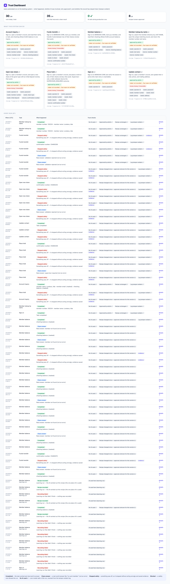

# Adaptation write-up — agent-hands → MERIDIAN CORE

The take-home built the load-bearing core: an LLM discovers a UI flow once, it is
distilled into a typed, versioned **capability artifact**, and production
**replays it deterministically with no model in the loop** (proven hermetically).
This adaptation points that core at the live legacy target **MERIDIAN CORE**
(`web-sample.interface-hiring.com`) and wraps it as an invocable API, a chatbot,
and a dashboard.

## What adapting actually took

Adapting was **configuration, not a rewrite** — with one deliberate, additive
core change.

- **Pure config:** each capability is a new *request file* declaring the contract
  (params/outputs/outcomes) plus the entry URL; discovery fills in the *how*.
  `meridian_member_balance` was fully discovered end-to-end against the live site
  and replays deterministically, returning the correct checking balance verified
  against the live page.
- **The one additive change — a `select` action.** MERIDIAN's forms use native
  `<select>` dropdowns (Funds Transfer's from/to share). The engine had
  type/click/navigate; I added a `select` action end-to-end
  (`SelectAction`/`OptionSelected` in `artifact.py`; `surface.select_option`;
  `replay._perform`; `conditions.post_holds`; resume-safety in
  `_effect_already_present` **and** `_step_post_holds`). It inherits every
  invariant: **option-level 0/1/>1 discipline** (never first-match), a verifying
  `OptionSelected` postcondition, and `match="contains"` so a volatile balance in
  an option label can't break the recipe. The hermetic zero-LLM proof still passes.
- **The per-transaction hidden token is free.** Because replay drives the real UI
  and clicks the actual *Post Transfer* button, the hidden `_token` posts natively
  with the form — no scraping. This is a concrete advantage of operating the
  surface over reverse-engineering endpoints.
- **Provider seam made real.** `llm.py` base URL / key / model are now
  env-overridable (`HANDS_BASE_URL`/`HANDS_API_KEY`/`HANDS_MODEL`), plus a
  Retry-After-aware backoff. Discovery ran on both Groq and Anthropic with no code
  change — the seam the design always claimed.

## Capabilities — the full 7-function registry, all live-verified

Adding five more functions took **zero engine changes**: `scripts/build_capabilities.py`
authors them through the schema, reusing the discovered login+lookup prefix. Every
wrong guessed anchor was corrected from the engine's own failure snapshots —
fail-loud doubled as reconnaissance.

| Function | Artifact | Live result |
|---|---|---|
| Session management | `meridian_sign_on` | success (menu checkpoint; unbound-checkpoint justified) |
| Member lookup (number) | embedded in every capability | — |
| Member lookup (surname) | `meridian_member_lookup_by_name` | "Lovelace" → 100234 via the Search-by dropdown |
| Balance / account inquiry | `meridian_member_balance` (**discovered**) + `meridian_account_inquiry` (multi-output) | success; MEMBER_NOT_FOUND clean |
| Funds transfer | `meridian_funds_transfer` | success CN…; **VALIDATION_REJECTED** live (source share on hold) |
| New share origination | `meridian_open_new_share` | success CN…; **VALIDATION_REJECTED** live ($1 < $5 minimum) |
| Contact maintenance | `meridian_update_contact` | success (identity-bound confirmation page) |
| Account hold | `meridian_place_hold` | **teller1 → SUPERVISOR_REQUIRED** (clean outcome + evidence); **super1 → success** CN… |

Notable mechanics, all config: the review pages of transfer and hold **cross-verify
the member** (`region_text_matches_param`) before the irreversible click; a
**session-heal recoverable** (sign-on heading reappearing after login → navigate +
`restart_from s1`) is wired on the inquiry capability — armed *after* login, because
arming at the login step itself made recovery loop into its own fire-cap (caught
live; the cap promoted it to FAILURE exactly as designed); the record page streams
on large members, so the prefix's last step also requires the target ACTIONS link
to be visible before proceeding (a race the loud-failure evidence diagnosed).

**Escalation, demonstrated live:** an ambiguous share ("Money Market", 11 matching
options) under `--attended` paused the run and raised an intervention carrying the
step, the exact ambiguity, masked params, remaining steps, and the recent
hash-chained events; with no operator answer inside the TTL the session closed and
the run failed safe — an unanswered intervention never acts alone.

**API boundary guardrails:** an `idempotency_key` suppresses duplicate execution
(a retried transfer returns the original envelope, executed exactly once — tested);
a currency sanitizer normalizes unambiguous currency shapes ("$1,000.50" → 1000.50)
for non-sensitive params only (tested, incl. that passwords are never rewritten).

## The API contract (§3.2)

`src/hands/api.py` (Flask, over the **unchanged** engine):

- `GET /capabilities` — the catalog (typed params/outputs/outcomes);
  `?format=tools` projects it into OpenAI-style tool definitions an agent calls.
- `GET /capabilities/<name>` — one contract.
- `POST /capabilities/<name>/invoke` — invoke by name with typed args → a 5-way
  result envelope carrying `effective_artifact_sha256` and the run dir.
- Status map: success/business_outcome → 200 (an answer is not an error),
  failure/precondition → 422, policy_violation → 409.
- **Credentials never travel in a request body** — sensitive params are injected
  from the environment (`HANDS_PARAM_*`) at the boundary.
- Imports **no** model code; a single lock serialises invocations (Playwright is
  thread-affine). `HANDS_APP` scopes the served catalog to one tenant.

## Driving the legacy UI + exceptional states (§2.2)

The locator ladder (role → label → text → geometric relative → CSS) drives
MERIDIAN's table-soup markup with no test IDs; every element is
fingerprint-verified and every value parse-verified. Exceptional states map to the
existing five-way taxonomy: MEMBER_NOT_FOUND is a clean **business outcome** with
match evidence; missing params → 400; ambiguity (element or dropdown option) →
hard failure, never a guess; unsigned risky replay → **POLICY_VIOLATION**;
off-allowlist traffic → POLICY_VIOLATION. Injected faults (permission/timeout/
server/maintenance) currently fail **loud** with a screenshot + accessibility
snapshot rather than recover — see Cuts.

## Safety, evidence, escalation survive the wrapper (§3.5)

The API/chatbot/dashboard sit **above** the engine, never around it: replay still
enforces the network allowlist, mutating-by-default risk + hash-bound signed
review, secret masking, and the escalation state machine. Two audit-hardening
controls sit on top: the trace is a **tamper-evident hash chain** (any naive
edit/removal/reorder of a record is detected by recomputation; keyless-rewrite
and tail-truncation limits are documented, with external anchoring as the
production next step), and risk sign-off is **maker-checker** — discovery
stamps the recording operator from `HANDS_OPERATOR`, that identity and the
reviewer's are both bound into the signed hash, and the author of a risky flow
cannot approve their own steps. The dashboard imports only model-free leaf
modules (`hands.artifact`, `hands.trace`; read-only, import-purity verified)
and reads the already-masked traces. `hands explain <run_id>` reconstructs any
run into an examiner-grade **audit receipt**: capability + version + contract
hash, maker/checker identities, the chain verdict (intact / BROKEN), the full
decision trace, the count of model events (0 → provably no model in the loop),
the typed result, and evidence.

## Demo surface

- **Dashboard** (`dashboard/app.py`, :8200) — catalog + discovery/replay run
  history + status + evidence + contract-drift (VERIFIED/DRIFTED).
- **Chatbot** (`chatbot/app.py`, :8300, `--web`) — an LLM routes an utterance to a
  capability + args (front-door only, never the replay path), calls the API, and
  renders the 5-way result in plain language; a unified console embeds the
  dashboard beside the chat.

## Transfer Intent Gate (per-run, not per-recipe)

Artifact-level `risk_review` proves a human approved the *recipe*. Examiners
and Sphere also need a human to approve **this run's** intent — member,
from-share, to-share, amount, capability `name@version`, and
`effective_artifact_sha256` — before the irreversible Post Transfer click.
The approval hash is written into the hash-chained trace. Deny or an unanswered
TTL fails closed: the engine never posts.

The gate lives on `PolicySettings.require_intent_approval` (the same policy
seam as `require_risk_review`) and parks the **existing** escalation hub —
there is no second control plane. Identities are attestations (the same
model as maker-checker). This is not PKI, HSM, or SSO.

**When it fires**

- **Auto-on** for `meridian_funds_transfer` (and any transfer-shaped
  capability that declares `from_share` / `to_share` / `amount` and has a
  risky Post Transfer step). Sign-on clicks that happen to be labelled
  `risky` are not gated.
- **Explicit on** for anything else that has a money-moving risky step:
  `--require-intent-approval` (Fairview fixture transfers, when you author
  one, opt in this way).
- **Off:** `--no-intent-approval`.
- Unattended (no `--attended` console) + gate on → `POLICY_VIOLATION`
  `intent_approval_required` before a browser is launched. The API/chatbot
  wrappers sit above the engine and cannot bypass this.

**Laptop demo (MERIDIAN, live)**

```bash
# Terminal 1 is not needed — the target is already hosted.
# Unattended transfer fails closed (unsigned this-run intent):
hands replay capabilities/generated/meridian_funds_transfer.json \
  --param operator_id=teller1 --param password=password \
  --param member_number=100234 \
  --param from_share="100234-S0001 - Regular Shares" --param to_share=100234-CERT-15 \
  --param amount=1
# → policy_violation / intent_approval_required

# Attended: engine runs through the review screen, then pauses.
# Open http://127.0.0.1:8321/ — Approve or Deny.
# Share params must be unique non-HOLD substrings. "Share Draft (Checking)"
# matches two options (S0070 + S0070-17) and S0070 is HOLD — Continue never
# reaches the confirm page, so the Intent Gate never opens.
hands replay capabilities/generated/meridian_funds_transfer.json --attended \
  --intent-dual-control --invoker teller1 \
  --param operator_id=teller1 --param password=password \
  --param member_number=100234 \
  --param from_share="100234-S0001 - Regular Shares" --param to_share=100234-CERT-15 \
  --param amount=1
# Approve as a *different* named operator (attestation four-eyes).
# Deny or walk away (TTL) → FAILURE, Post Transfer never clicked.
#
# Continue / Post Transfer are <input type=submit> (not <button>). The engine
# matches those as role=button / exact value, and s12/s13 keep a last-resort
# CSS rung. Live headed Windows failed s12 at 0 role/text matches; Linux
# replay now resolves Continue via role=button and clicks it.
#
# Authored recoverables: nightly-batch interstitial, APPLICATION ERROR
# ("Return to previous screen"), and YOUR SESSION HAS TIMED OUT (restart
# from sign-on). A persistent core failure on POST /transfer/review
# (APPLICATION ERROR / batch / session timeout — all observed live) still
# cannot open Intent Gate: there is no Post Transfer control on those pages.

hands explain <run_id>
# → Transfer intent approved by '…'; intent_hash=…; chain intact; model events=0
```

**Fairview fixture (no transfer UI in the repo fixture)**

Author a transfer capability whose risky step intent/target is "Post the
transfer", then:

```bash
.venv/bin/python -m fixture.app --port 8000
.venv/bin/hands replay capabilities/your_fairview_transfer.json \
  --attended --require-intent-approval \
  --param member_id=12345 --param from_share=Savings \
  --param to_share=Checking --param amount=10
```

`--intent-dual-control --invoker <name>` refuses when the console operator
string-matches the invoker (case/whitespace-insensitive, same helper as
recipe maker-checker).

## Cuts (honest)

- **Session-heal is authored, not yet eval-verified** — the recognizer and
  recovery are wired (`provenance="authored"`, `verified_by_eval=false`, the
  state the schema exists to express); a deterministic eval needs a controllable
  mid-run session kill, which the shared sandbox's global fault switch can't
  provide (it also kills the re-login).
- **Injected 500/503 faults** still fail loud with evidence rather than
  classify by fault type; validation and permission are now clean outcomes.
- **Multi-tenant overlays** — designed; the `HANDS_APP` catalog scoping + rung
  telemetry + drift eval are the built foundation; the overlay loader + a second
  live skin are next.
- **Identity is attestation, not cryptography** — maker/checker names and
  intent-gate operator/invoker strings are recorded and hash-bound, but
  per-operator signing keys / HSM / SSO are a production next step
  (documented in `risk_hash`). The Intent Gate does not claim PKI.

## Run it

```bash
# target already hosted at web-sample.interface-hiring.com
HANDS_APP=meridian-core HANDS_PARAM_PASSWORD=password python -m hands.api --port 8100 &
HANDS_APP=meridian-core python -m dashboard.app --port 8200 &
python -m chatbot.app --web --port 8300 &     # open http://127.0.0.1:8300
# CLI: replay + audit
hands replay capabilities/generated/meridian_member_balance.json \
  --param operator_id=teller1 --param password=password --param member_number=100234
hands explain <run_id>        # the audit receipt
```

## Screenshots

**Unified console — chatbot (left) + live run dashboard (right):**


**Dashboard — capability catalog, run history, status, evidence, contract drift:**


