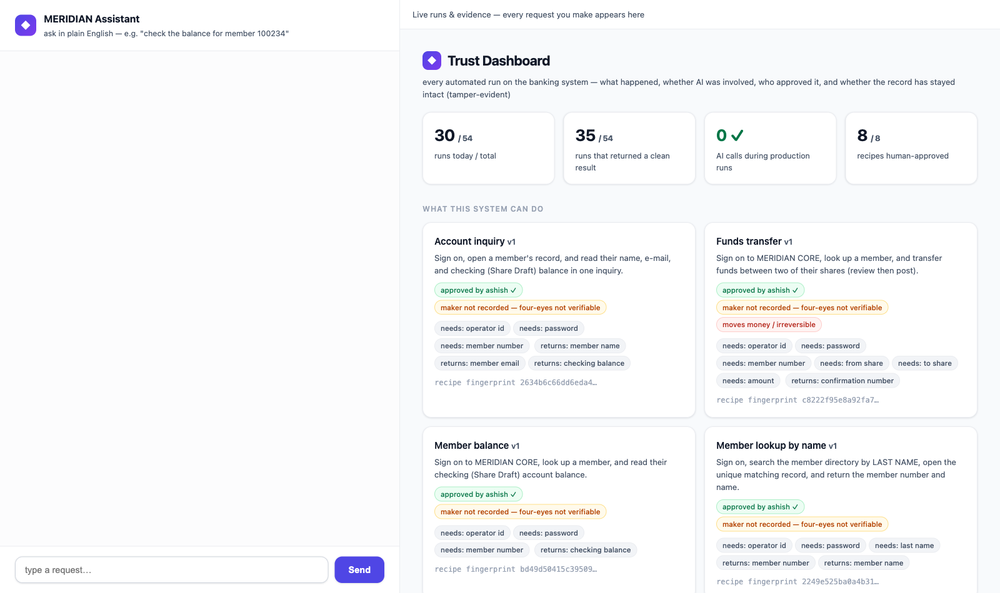
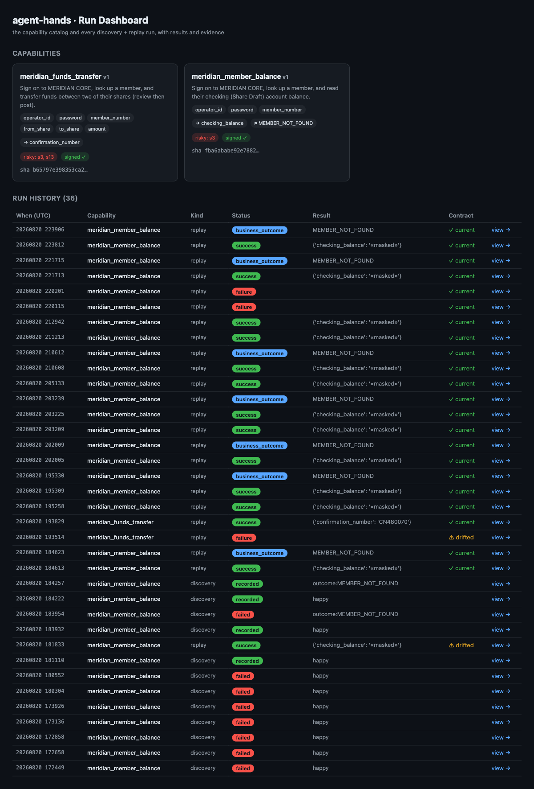

# Adaptation write-up — agent-hands → MERIDIAN CORE

The take-home built the load-bearing core: an LLM discovers a UI flow once, it is
distilled into a typed, versioned **capability artifact**, and production
**replays it deterministically with no model in the loop** (proven hermetically).
This adaptation points that core at the live legacy target **MERIDIAN CORE**
(`web-sample.interface-hiring.com`) and wraps it as an invocable API, a chatbot,
and a dashboard.

## What adapting actually took

Adapting was **configuration, not a rewrite** — with one deliberate, additive
core change.

- **Pure config:** each capability is a new *request file* declaring the contract
  (params/outputs/outcomes) plus the entry URL; discovery fills in the *how*.
  `meridian_member_balance` was fully discovered end-to-end against the live site
  and replays deterministically, returning the correct checking balance verified
  against the live page.
- **The one additive change — a `select` action.** MERIDIAN's forms use native
  `<select>` dropdowns (Funds Transfer's from/to share). The engine had
  type/click/navigate; I added a `select` action end-to-end
  (`SelectAction`/`OptionSelected` in `artifact.py`; `surface.select_option`;
  `replay._perform`; `conditions.post_holds`; resume-safety in
  `_effect_already_present` **and** `_step_post_holds`). It inherits every
  invariant: **option-level 0/1/>1 discipline** (never first-match), a verifying
  `OptionSelected` postcondition, and `match="contains"` so a volatile balance in
  an option label can't break the recipe. The hermetic zero-LLM proof still passes.
- **The per-transaction hidden token is free.** Because replay drives the real UI
  and clicks the actual *Post Transfer* button, the hidden `_token` posts natively
  with the form — no scraping. This is a concrete advantage of operating the
  surface over reverse-engineering endpoints.
- **Provider seam made real.** `llm.py` base URL / key / model are now
  env-overridable (`HANDS_BASE_URL`/`HANDS_API_KEY`/`HANDS_MODEL`), plus a
  Retry-After-aware backoff. Discovery ran on both Groq and Anthropic with no code
  change — the seam the design always claimed.

## Capabilities

- **`meridian_member_balance`** (must-have #1): sign on → member inquiry → search →
  select → read the checking balance. **Discovered.** Handles **MEMBER_NOT_FOUND**
  as a live-verified business outcome (a second discovery run against a nonexistent
  member; `provenance="discovered"`). A correctness fix: the Search step's
  postcondition was changed to a happy-only marker (the `Select` link) so the
  not-found recognizer isn't preempted — otherwise a not-found lookup would
  conflate into a FAILURE instead of the clean outcome.
- **`meridian_funds_transfer`** (must-have #2): sign on → member → Funds Transfer →
  `select` from/to share → amount → review → **post (risky)**. **Hand-authored**
  (Path B) reusing the discovered login+lookup prefix; moves real funds and returns
  the confirmation number. Deliberate cut, documented: discovery is already proven
  on the balance capability, so I spent the budget on the wrapper + safety.

## The API contract (§3.2)

`src/hands/api.py` (Flask, over the **unchanged** engine):

- `GET /capabilities` — the catalog (typed params/outputs/outcomes);
  `?format=tools` projects it into OpenAI-style tool definitions an agent calls.
- `GET /capabilities/<name>` — one contract.
- `POST /capabilities/<name>/invoke` — invoke by name with typed args → a 5-way
  result envelope carrying `effective_artifact_sha256` and the run dir.
- Status map: success/business_outcome → 200 (an answer is not an error),
  failure/precondition → 422, policy_violation → 409.
- **Credentials never travel in a request body** — sensitive params are injected
  from the environment (`HANDS_PARAM_*`) at the boundary.
- Imports **no** model code; a single lock serialises invocations (Playwright is
  thread-affine). `HANDS_APP` scopes the served catalog to one tenant.

## Driving the legacy UI + exceptional states (§2.2)

The locator ladder (role → label → text → geometric relative → CSS) drives
MERIDIAN's table-soup markup with no test IDs; every element is
fingerprint-verified and every value parse-verified. Exceptional states map to the
existing five-way taxonomy: MEMBER_NOT_FOUND is a clean **business outcome** with
match evidence; missing params → 400; ambiguity (element or dropdown option) →
hard failure, never a guess; unsigned risky replay → **POLICY_VIOLATION**;
off-allowlist traffic → POLICY_VIOLATION. Injected faults (permission/timeout/
server/maintenance) currently fail **loud** with a screenshot + accessibility
snapshot rather than recover — see Cuts.

## Safety, evidence, escalation survive the wrapper (§3.5)

The API/chatbot/dashboard sit **above** the engine, never around it: replay still
enforces the network allowlist, mutating-by-default risk + hash-bound signed
review, secret masking, and the escalation state machine. Two audit-hardening
controls sit on top: the trace is a **tamper-evident hash chain** (any naive
edit/removal/reorder of a record is detected by recomputation; keyless-rewrite
and tail-truncation limits are documented, with external anchoring as the
production next step), and risk sign-off is **maker-checker** — discovery
stamps the recording operator from `HANDS_OPERATOR`, that identity and the
reviewer's are both bound into the signed hash, and the author of a risky flow
cannot approve their own steps. The dashboard imports only model-free leaf
modules (`hands.artifact`, `hands.trace`; read-only, import-purity verified)
and reads the already-masked traces. `hands explain <run_id>` reconstructs any
run into an examiner-grade **audit receipt**: capability + version + contract
hash, maker/checker identities, the chain verdict (intact / BROKEN), the full
decision trace, the count of model events (0 → provably no model in the loop),
the typed result, and evidence.

## Demo surface

- **Dashboard** (`dashboard/app.py`, :8200) — catalog + discovery/replay run
  history + status + evidence + contract-drift (VERIFIED/DRIFTED).
- **Chatbot** (`chatbot/app.py`, :8300, `--web`) — an LLM routes an utterance to a
  capability + args (front-door only, never the replay path), calls the API, and
  renders the 5-way result in plain language; a unified console embeds the
  dashboard beside the chat.

## Cuts (honest)

- **Graceful fault recovery** — injected faults fail loud with evidence rather
  than recover or classify by type; wiring each to a recovery/business outcome is
  the top next step (the escalation machine already exists).
- **INSUFFICIENT_FUNDS / PERMISSION_DENIED** outcomes and the supervisor-gated
  **Place Hold** capability (which would drive the escalation demo) — not yet
  wired.
- **Open New Share / Update Member Info** — not built (thin, additive request files).
- **Multi-tenant overlays** — designed; the `HANDS_APP` catalog scoping + rung
  telemetry + drift eval are the built foundation; the overlay loader + a second
  live skin are next.

## Run it

```bash
# target already hosted at web-sample.interface-hiring.com
HANDS_APP=meridian-core HANDS_PARAM_PASSWORD=password python -m hands.api --port 8100 &
HANDS_APP=meridian-core python -m dashboard.app --port 8200 &
python -m chatbot.app --web --port 8300 &     # open http://127.0.0.1:8300
# CLI: replay + audit
hands replay capabilities/generated/meridian_member_balance.json \
  --param operator_id=teller1 --param password=password --param member_number=100234
hands explain <run_id>        # the audit receipt
```

## Screenshots

**Unified console — chatbot (left) + live run dashboard (right):**



**Dashboard — capability catalog, run history, status, evidence, contract drift:**


